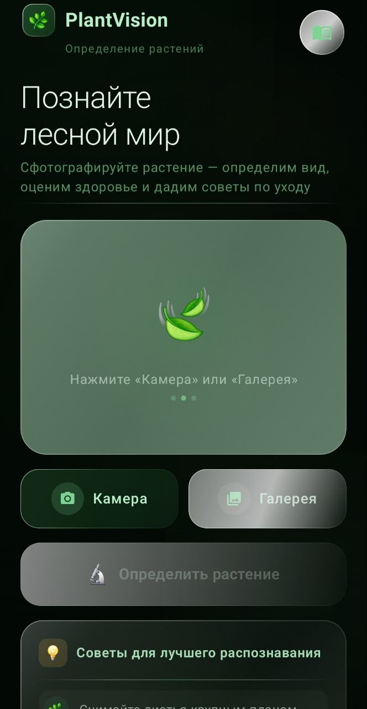
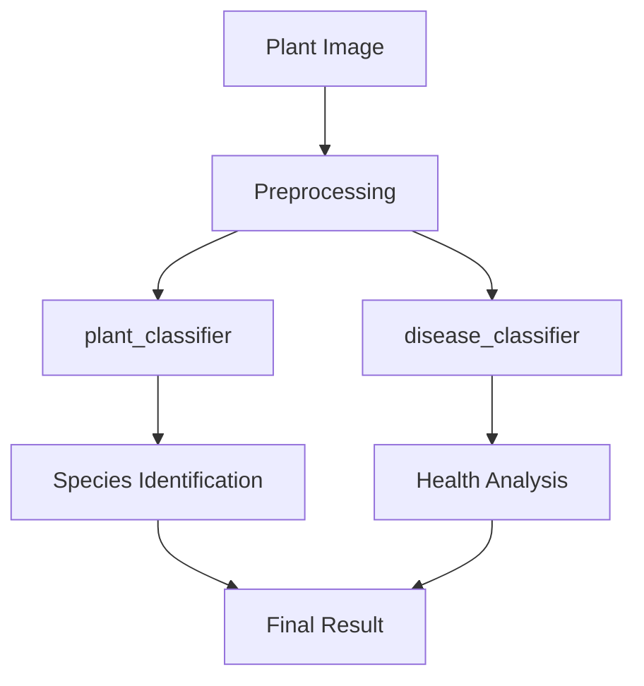

# PlantVision

<p align="center">
  
</p>

<p align="center">
  Intelligent Android application for plant recognition and health analysis using on-device machine learning
</p>

---

<p align="center">


</p>

---

## Overview

PlantVision is an Android application that uses on-device machine learning to identify plant species and analyze their health condition.  
The app processes images locally using TensorFlow Lite models, ensuring fast performance and full offline functionality.

---

## Features

- Plant recognition from images  
- Species identification  
- Plant disease detection and health analysis  
- Care recommendations based on results  
- Fully offline processing  
- Integrated ML models:
  - `plant_classifier`
  - `disease_classifier`

---

## Screenshots
<p align="center">
  
</p>

---

## Architecture

The application follows a clean and modular structure, separating UI, business logic, and ML processing.

Core flow:

1. Image input (camera or gallery)  
2. Image preprocessing  
3. Inference using TensorFlow Lite  
4. Aggregation of results  
5. Display of classification and recommendations  

---

## Tech Stack

- Kotlin  
- Android SDK  
- TensorFlow Lite  
- Material Design  
- Gradle (Kotlin DSL)  

---

## Performance

- Optimized for mobile inference  
- Supports hardware acceleration (GPU delegate when available)  
- Low latency predictions  
- No network dependency  

---

## Getting Started

```bash
git clone https://github.com/your-username/PlantVision.git
cd PlantVision
```

Open the project in **Android Studio** and run:

```bash
Run → Run 'app'
```

## Project Structure

```
app/
 ├── src/main/
 │   ├── java/        # application logic
 │   ├── res/         # UI resources
 │   └── assets/      # ML models
```

## How It Works



## Roadmap

- Extended plant database
- Favorites system
- Recognition history
- Multi-language support
- Improved model accuracy

## Contributing

Contributions are welcome.

1. Fork the repository  
2. Create a feature branch (`feature/...`)  
3. Commit your changes  
4. Open a Pull Request

## License

This project is licensed under the MIT License.

## Contact

For questions or suggestions, open an issue in the repository.

## Acknowledgements

- TensorFlow Lite team  
- Open-source ML community  
- Android development community

## Support

If you find this project useful, consider starring the repository.

## Author

Клименко Михаил Сергеевич
БрГТУ, факультет ЭИС, кафедра ИИТ, 2026
